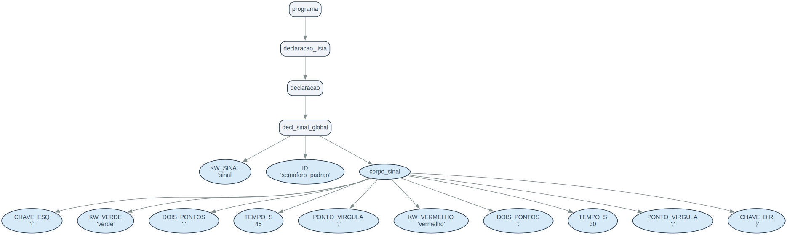
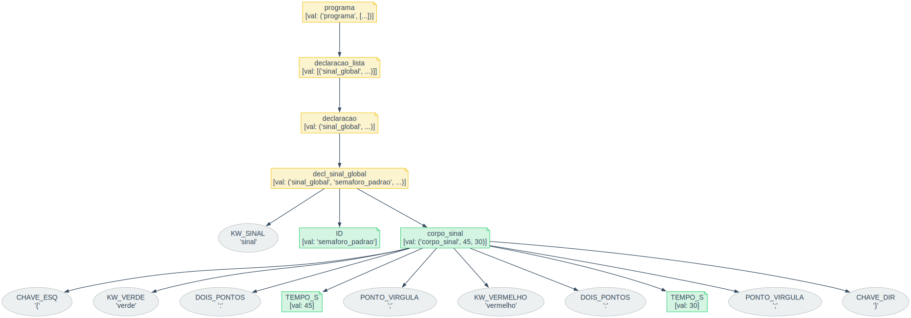
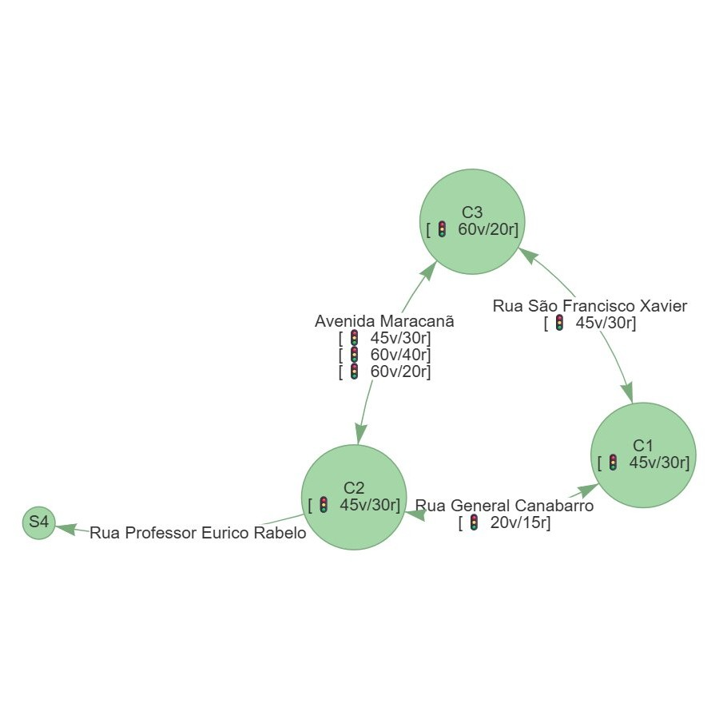

# Compilador CityFlow

Compilador de uma linguagem de descrição de malha urbana. Um arquivo `.cf` descreve ruas, sinais de trânsito e cruzamentos de um bairro. O compilador realiza análise léxica, sintática e semântica, e gera como saída um arquivo `.json` estruturado.

Gerador de analisador utilizado: **PLY (Python Lex-Yacc)**.

---

## Estrutura do projeto

```
.
├── analisador_lexico.py      # Análise léxica (tokens e expressões regulares)
├── analisador_sintatico.py   # Análise sintática (gramática e construção da AST)
├── analisador_semantico.py   # Análise semântica (validações e geração do JSON)
├── meu_bairro.cf             # Exemplo de entrada
├── meu_bairro.json           # Saída gerada pelo compilador
└── visualizador_grafo.html   # Visualizador do grafo de ruas no navegador
```

---

## Como executar

**Pré-requisito:** Python 3 com PLY instalado.

```bash
pip install ply
```

**Compilar um arquivo `.cf`:**

```bash
python analisador_sintatico.py meu_bairro.cf
```

A saída será gerada automaticamente como `meu_bairro.json` no mesmo diretório.

---

## A linguagem `.cf`

### Tokens e expressões regulares (análise léxica)

| Token | Expressão Regular | Descrição |
| :--- | :--- | :--- |
| `MEDIDA_M` | `[0-9]+m(?![a-zA-Z_À-ÿ])` | Medida em metros. Ex: `300m` → converte para inteiro `300` |
| `TEMPO_S` | `[0-9]+s(?![a-zA-Z_À-ÿ])` | Tempo em segundos. Ex: `45s` → converte para inteiro `45` |
| `STRING` | `\"[^"\n]*\"` | Cadeia entre aspas duplas. Ex: `"Avenida Paulista"` |
| `ID` | `[a-zA-ZÀ-ÿ_][a-zA-Z0-9À-ÿ_]*` | Identificador (resolve palavras reservadas) |
| `CHAVE_ESQ` | `\{` | Abre bloco |
| `CHAVE_DIR` | `\}` | Fecha bloco |
| `DOIS_PONTOS` | `:` | Separador de atributo |
| `PONTO_VIRGULA` | `;` | Terminador de instrução |

**Palavras reservadas:** `rua`, `tamanho`, `mao`, `dupla`, `unica`, `sinal`, `verde`, `vermelho`, `em`, `cruzamento`, `de`, `para`.

Comentários suportados: `// linha` e `/* bloco */`.

---

### Sintaxe da linguagem

Um arquivo `.cf` é composto por três tipos de declaração, nesta ordem livre:

#### 1. Sinal global (reutilizável por nome)

```
sinal semaforo_padrao {
    verde: 45s;
    vermelho: 30s;
}
```

#### 2. Rua

```
rua "Avenida Paulista" {
    tamanho: 3000m;
    mao: dupla;
    sinal em 500m semaforo_padrao;        // sinal por referência
    sinal em 1500m { verde: 60s; vermelho: 40s; }  // sinal inline
}
```

O atributo `mao` aceita `dupla` ou `unica`. Sinais internos podem ser definidos por referência a um sinal global ou com corpo inline.

#### 3. Cruzamento

```
cruzamento {
    "Avenida Paulista" em 1500m;
    "Rua Consolação"   em 0m;
    "Alameda Santos"   em 300m;

    de "Avenida Paulista" para "Rua Consolação";
    de "Avenida Paulista" para "Alameda Santos" {
        sinal { verde: 25s; vermelho: 35s; }
    }
    de "Alameda Santos" para "Avenida Paulista" {
        sinal semaforo_rapido;
    }

    sinal semaforo_padrao;   // sinal padrão do cruzamento
}
```

Entradas definem quais ruas se encontram e em qual posição. Pares `de/para` restringem o fluxo permitido. O `sinal` no nível do cruzamento é o sinal padrão aplicado aos pares sem sinal específico.

---

## Análise semântica

A análise semântica ocorre em **duas passagens** sobre a AST:

**Passagem 1 — Ruas e sinais globais:**
- Detecta nomes duplicados de rua e de sinal global.
- Popula o conjunto `ruas_declaradas` e `sinais_declarados`.

**Passagem 2 — Cruzamentos:**
- Verifica se cada rua citada em `entrada` foi declarada na Passagem 1.
- Verifica se as ruas citadas em pares `de/para` foram declaradas.

Erros semânticos encerram a compilação com mensagem descritiva antes de gravar o `.json`.

---

## Tabela de produções e regras semânticas

| Produções | Regras Semânticas |
| :--- | :--- |
| **PROGRAMA** | |
| programa → declaracao_lista | { programa.node = ('programa', declaracao_lista.node) } |
| declaracao_lista → declaracao_lista₁ declaracao | { declaracao_lista.node = declaracao_lista₁.node \|\| [declaracao.node] } |
| declaracao_lista → declaracao | { declaracao_lista.node = [declaracao.node] } |
| declaracao → decl_sinal_global | { declaracao.node = decl_sinal_global.node } |
| declaracao → decl_rua | { declaracao.node = decl_rua.node } |
| declaracao → decl_cruzamento | { declaracao.node = decl_cruzamento.node } |
| **SINAL GLOBAL** | |
| decl_sinal_global → sinal ID corpo_sinal | { verifica_duplicado(ID.val, sinais_declarados); insere_simbolo(sinais_declarados, ID.val); decl_sinal_global.node = ('sinal_global', ID.val, corpo_sinal.node) } |
| corpo_sinal → { verde : TEMPO_S ; vermelho : TEMPO_S ; } | { corpo_sinal.node = ('corpo_sinal', TEMPO_S₁.val, TEMPO_S₂.val) } |
| **RUA** | |
| decl_rua → rua STRING { rua_item_lista } | { verifica_duplicado(STRING.val, ruas_declaradas); insere_simbolo(ruas_declaradas, STRING.val); decl_rua.node = ('rua', STRING.val, rua_item_lista.node) } |
| rua_item_lista → rua_item_lista₁ rua_item | { rua_item_lista.node = rua_item_lista₁.node \|\| [rua_item.node] } |
| rua_item_lista → rua_item | { rua_item_lista.node = [rua_item.node] } |
| rua_item → rua_tamanho | { rua_item.node = rua_tamanho.node } |
| rua_item → rua_mao | { rua_item.node = rua_mao.node } |
| rua_item → rua_sinal_ref | { rua_item.node = rua_sinal_ref.node } |
| rua_item → rua_sinal_inline | { rua_item.node = rua_sinal_inline.node } |
| rua_tamanho → tamanho : MEDIDA_M ; | { rua_tamanho.node = ('tamanho', MEDIDA_M.val) } |
| rua_mao → mao : mao_valor ; | { rua_mao.node = ('mao', mao_valor.val) } |
| mao_valor → dupla | { mao_valor.val = 'dupla' } |
| mao_valor → unica | { mao_valor.val = 'unica' } |
| rua_sinal_ref → sinal em MEDIDA_M ID ; | { rua_sinal_ref.node = ('sinal_rua', MEDIDA_M.val, ('sinal_ref', ID.val)) } |
| rua_sinal_inline → sinal em MEDIDA_M corpo_sinal | { rua_sinal_inline.node = ('sinal_rua', MEDIDA_M.val, ('sinal_inline', corpo_sinal.node)) } |
| **CRUZAMENTO** | |
| decl_cruzamento → cruzamento { cruzamento_item_lista } | { decl_cruzamento.node = ('cruzamento', cruzamento_item_lista.node) } |
| cruzamento_item_lista → cruzamento_item_lista₁ cruzamento_item | { cruzamento_item_lista.node = cruzamento_item_lista₁.node \|\| [cruzamento_item.node] } |
| cruzamento_item_lista → cruzamento_item | { cruzamento_item_lista.node = [cruzamento_item.node] } |
| cruzamento_item → cruzamento_entrada | { cruzamento_item.node = cruzamento_entrada.node } |
| cruzamento_item → cruzamento_par_simples | { cruzamento_item.node = cruzamento_par_simples.node } |
| cruzamento_item → cruzamento_par_com_corpo | { cruzamento_item.node = cruzamento_par_com_corpo.node } |
| cruzamento_item → cruzamento_sinal_ref | { cruzamento_item.node = cruzamento_sinal_ref.node } |
| cruzamento_item → cruzamento_sinal_inline | { cruzamento_item.node = cruzamento_sinal_inline.node } |
| cruzamento_entrada → STRING em MEDIDA_M ; | { verifica_existe(STRING.val, ruas_declaradas); cruzamento_entrada.node = ('entrada', STRING.val, MEDIDA_M.val) } |
| cruzamento_sinal_ref → sinal ID ; | { cruzamento_sinal_ref.node = ('sinal_default', ('sinal_ref', ID.val)) } |
| cruzamento_sinal_inline → sinal corpo_sinal | { cruzamento_sinal_inline.node = ('sinal_default', ('sinal_inline', corpo_sinal.node)) } |
| **PAR DE/PARA** | |
| cruzamento_par_simples → de STRING₁ para STRING₂ ; | { verifica_existe(STRING₁.val, ruas_declaradas); verifica_existe(STRING₂.val, ruas_declaradas); cruzamento_par_simples.node = ('par', STRING₁.val, STRING₂.val, None) } |
| cruzamento_par_com_corpo → de STRING₁ para STRING₂ { par_sinal } | { verifica_existe(STRING₁.val, ruas_declaradas); verifica_existe(STRING₂.val, ruas_declaradas); cruzamento_par_com_corpo.node = ('par', STRING₁.val, STRING₂.val, par_sinal.node) } |
| par_sinal → sinal ID ; | { par_sinal.node = ('sinal_ref', ID.val) } |
| par_sinal → sinal corpo_sinal | { par_sinal.node = ('sinal_inline', corpo_sinal.node) } |

---
## Árvores de Derivação

**Árvore de Derivação (Parse Tree):**


**Árvore de Derivação Anotada (Annotated Parse Tree):**

## Saída JSON

O compilador gera um `.json` com a seguinte estrutura:

```json
{
    "sinais_globais": {
        "semaforo_padrao": { "verde_s": 45, "vermelho_s": 30 }
    },
    "ruas": [
        {
            "id": "Avenida Paulista",
            "tamanho_m": 3000,
            "mao": "dupla",
            "sinais_internos": [
                { "posicao_m": 500, "configuracao": { "referencia": "semaforo_padrao" } }
            ]
        }
    ],
    "cruzamentos": [
        {
            "entradas": [
                { "rua": "Avenida Paulista", "posicao_m": 500 },
                { "rua": "Rua Augusta",      "posicao_m": 0   }
            ],
            "sinal_padrao": { "referencia": "semaforo_padrao" },
            "rotas": []
        }
    ]
}
```

---

## Visualizador de grafo

Abra o arquivo `visualizador_grafo.html` no navegador, cole o conteúdo do `.json` gerado e clique em **Gerar Grafo**.

- Cada nó representa um cruzamento.
- Cada aresta representa uma rua, com seu nome e sinais internos exibidos como rótulo.
- Ruas de mão única são exibidas com seta direcional.
- Ruas de mão dupla são exibidas com setas nos dois sentidos.

**Exemplo do grafo gerado:**


---

## 🤖 Uso de Inteligência Artificial

Atendendo aos requisitos da disciplina, o desenvolvimento deste projeto contou com o auxílio de ferramentas de Inteligência Artificial (Claude e Gemini) para tirar dúvidas pontuais sobre a biblioteca PLY e estruturar a lógica do visualizador web 

As decisões de design de software, modelagem da gramática, arquitetura em duas passagens semânticas e a criação do roteiro de testes foram desenvolvidas de forma autoral. As modificações sugeridas pelas IAs foram adaptadas e documentadas com comentários no código-fonte.

Abaixo estão os prompts exatos utilizados durante o ciclo de desenvolvimento:

### Prompts utilizados
**Pesquisa e Estruturação do PLY:**
* "Quais são os principais geradores de analisadores léxicos e sintáticos disponíveis em Python? Me explica como funciona o PLY (Python Lex-Yacc)"
* "Me dá um exemplo básico de calculadora usando PLY em Python, com analisador léxico e sintático separados."

**Modelagem e Análise Léxica:**
* "Quero criar uma linguagem de descrição de malha urbana chamada CityFlow. Ela deve permitir declarar ruas com tamanho, sentido de mão (dupla ou única) e sinais de trânsito em posições específicas, além de cruzamentos entre ruas com controle de fluxo. Como eu modelaria essa gramática?"
* "Como declarar tokens no PLY para unidades como 300m e 45s, convertendo automaticamente para inteiro durante a análise léxica, sem deixar o m e o s no valor?"
* "Como reportar erros léxicos com número de linha e coluna no PLY?"

**Análise Sintática e Semântica:**
* "Como estruturar produções no PLY para uma lista de itens recursiva à esquerda, como múltiplas declarações de rua dentro de um arquivo?"
* "Como construir uma AST usando tuplas no PLY, retornando p[0] em cada produção com a estrutura da árvore?"
* "Como percorrer uma AST em Python em duas passagens: a primeira para registrar ruas e sinais globais declarados, e a segunda para validar cruzamentos que referenciam essas ruas?"

**Visualizador do Grafo:**
* "Como usar a biblioteca vis-network em JavaScript para visualizar um grafo de ruas e cruzamentos a partir de um JSON? Cada cruzamento deve ser um nó e cada rua compartilhada entre dois cruzamentos deve ser uma aresta com o nome da rua como rótulo."